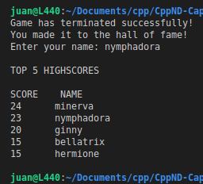

# Snake Game Boosted

This is the repo of my Capstone project for the [Udacity C++ Nanodegree Program](https://www.udacity.com/course/c-plus-plus-nanodegree--nd213). The code for this repo was inspired by [this](https://codereview.stackexchange.com/questions/212296/snake-game-in-c-with-sdl) excellent StackOverflow post and set of responses and was based on the [starter repo](https://github.com/udacity/CppND-Capstone-Snake-Game) provided by Udacity.

## Description
This Snake Game is part of the the [Snake video game genre](https://en.wikipedia.org/wiki/Snake_(video_game_genre)). In this adaptation there are 5 levels with different obstacles.  The current level and score is always displayed on the top bar of the game. The player must eat 5 pieces of food in each level to pass to the next one. After each level the snake's body is reinitialized, but its speed keeps incrementing with each eaten unit of food. When the player hits an obstacle, the game is over. When you quit the game (by closing the window or pressing the escape key), the player may enter his/her name if his/her score is among the top five. Finally the top 5 highscores list is displayed on the terminal. 

## Dependencies for Running Locally
* cmake >= 3.7
  * All OSes: [click here for installation instructions](https://cmake.org/install/)
* make >= 4.1 (Linux, Mac), 3.81 (Windows)
  * Linux: make is installed by default on most Linux distros
  * Mac: [install Xcode command line tools to get make](https://developer.apple.com/xcode/features/)
  * Windows: [Click here for installation instructions](http://gnuwin32.sourceforge.net/packages/make.htm)
* SDL2 >= 2.0
  * All installation instructions can be found [here](https://wiki.libsdl.org/Installation)
  * Note that for Linux, an `apt` or `apt-get` installation is preferred to building from source.
* gcc/g++ >= 5.4
  * Linux: gcc / g++ is installed by default on most Linux distros
  * Mac: same deal as make - [install Xcode command line tools](https://developer.apple.com/xcode/features/)
  * Windows: recommend using [MinGW](http://www.mingw.org/)

## Basic Build Instructions
1. Clone this repo.
2. Make a build directory in the top level directory: `mkdir build && cd build`
3. Compile: `cmake .. && make`
4. Run it: `./SnakeGame`.

## File and class structure
There are a total of 5 classes (game, renderer, controller, snake and level) with their corresponding header files, plus the main.cpp. The first 3 classes are used for the main game loop, while the other two, describe the snake player character and the level logic. An additional highscores.txt is included to store the top 5 highest scores, as well as a folder named "pics", used by the readme file. 

## Expected behavior and output of the program
To demonstrate this point, sequential pictures of a typical gameplay are shown:
<table>
  <tr>
    <td></td>
    <td></td>
    <td></td>
  </tr>
  <tr>
    <td></td>
    <td></td>
    <td></td>
  </tr>
 </table>